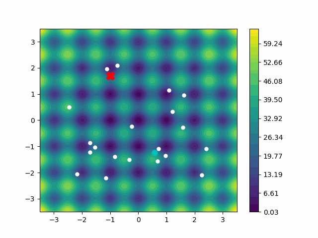
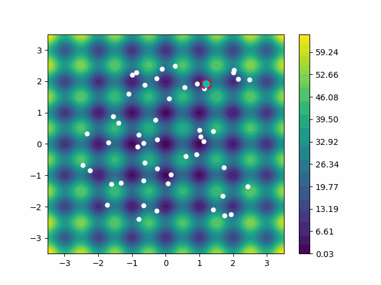
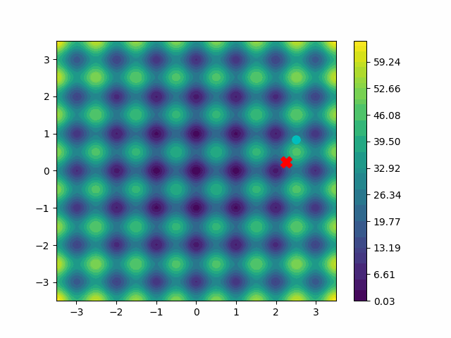
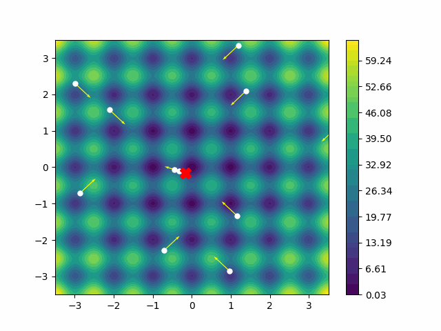
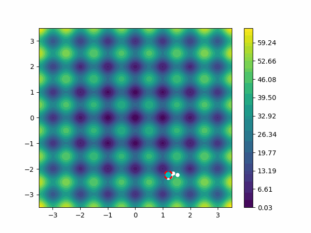

# Metaheuristic Visualizations

Implementations and visualizations for selected metaheuristic optimization algorithms

## Ant Colony Optimization

## Genetic Algorithm

## Harmony Search

## Simulated Annealing

## Particle Swarm Optimization

## Tabu Search

